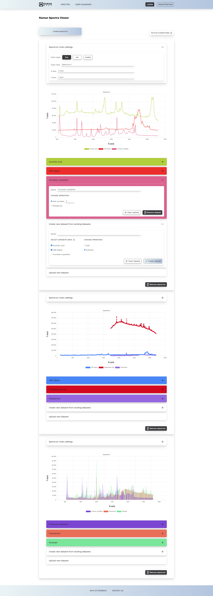

# Raman Spectrum Viewer

This is a Sveltekit application that displays a list of raman spectras fetched from a JSON server.

## Table of Contents

- [Features](#features)
- [Technologies Used](#technologies-used)
- [Screenshots](#screenshots)
- [Getting Started](#getting-started)
  - [Prerequisites](#prerequisites)
  - [Installation](#installation)
  - [Running the Application](#running-the-application)
- [API](#api)
- [Folder Structure](#folder-structure)
- [Room for improvement](#room-for-improvement)
- [Contact](#contact)

## Features

- Fetching spectras data from a local JSON server
- Modifying chart by mathematical operations on datasets
- Adding and removing spectras
- Adding, creating and removing datasets
- Modifying chart setting

## Technologies Used

- Sveltekit
- TypeScript
- Tailwind CSS
- Chart.js
- json-server

## Screenshots



## Getting Started

### Prerequisites

Make sure you have the following installed on your machine:

- [Node.js](https://nodejs.org/) (version 14 or later)
- [npm](https://www.npmjs.com/get-npm) (comes with Node.js)

### Installation

1. Clone the repository:

   ```bash
   git clone https://github.com/Wiolinek/raman-spectrum.git
   ```

2. Install the dependencies:

    ```bash
    cd frontend
    npm ci
    ```

3. Set up the JSON server:

    ```bash
    cd json-server
    npm ci
    ```

### Running the Application

1. Client:

   ```bash
   npm run dev
   ```

   frontend is running on http://localhost:3001

2. Json-server:

    ```bash
    npm run start
    ```
    server is runnig on http://localhost:5173
    

## API

The application fetches data from the following endpoint:

- Products: http://localhost:3001/spectra

## Folder Structure

Here's an overview of the project's folder structure:

    /frontend
        ├── /static              # Public assets (images, etc.)
        ├── /src
        │   ├── /lib             # Reusable logic, utilities and shared functions
        │   ├── /routes          # Routes of the application (pages)
        │   ├── /stores          # Svelte stores for managing app state
        │   ├── /interfaces      # TypeScript interfaces
        ├── package.json         # NPM package configuration
    /json-server
        ├── db.json              # Mock data for json-server
        ├── package.json         # NPM package configuration
    /README.md                   # Project documentation

## Room for improvement

- use form instead of regular elements
- implement MongoDB database instead of json-server
- deploy the project

## Contact

Created by [@Wiolinek](https://github.com/Wiolinek) - feel free to contact me!